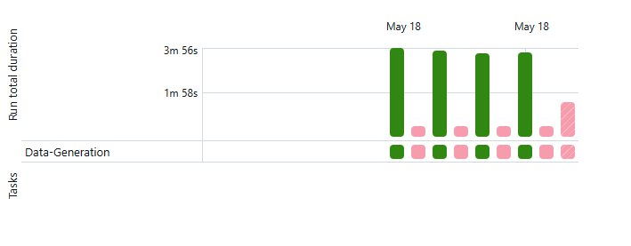

## Overview
This  Real-Time Point-of-Sale Solution utilizing Delta Live Tables (DLT) on Databricks with Amazon Managed Workflows for Apache Managed Streaming Kafka(MSK). This solution showcases how Delta Live Tables can be utilized to construct a near real-time lakehouse architecture for calculating current inventories of various products across multiple store locations. Instead of directly transitioning from raw data ingestion to inventory calculations, I've structured this solution into two distinct phases.

## Introduction
The initial phase, known as Bronze-to-Silver ETL, involves transforming ingested data to enhance accessibility. The actions performed on the data at this stage, such as breaking down nested arrays and removing duplicate records, do not involve applying any business-driven interpretations. The tables generated in this phase represent the Silver layer of our lakehouse architecture.

In the subsequent phase, referred to as Silver-to-Gold ETL, the Silver tables are leveraged to derive the business-aligned output, which is the calculated current-state inventory. The resulting data is stored in a table representing the Gold layer of our architecture.

Throughout this two-phase workflow, I employ Delta Live Tables (DLT) for orchestration and monitoring.
## Data - All the data is been uploaded in DOC folder.
## Definition

* *Notebook_01: Environment Setup*
* *Notebook_02: Data_Generation -- Scheuled to run every 2 mins to push data to Kafka and S3 Bukcet *
* *Notebook_03: Data - Consumer (Bronze to Gold)ETL for Broze Layer to Silver Layer*
* *Notebook_04: Silver_To_Gold (ETL for Silver to Gold Layer) *
* *Notebook_05: Orchestration- JOB Scheduling_DLT*
## DLT Pipeline
 **DLT Table Creation**
   - **raw_inventory_change**: Streaming table reads data from Kafka.
   - **item**: Reads data from S3 file item.
   - **inventory_snapshot**: Snapshot data from S3 produced using data generation.
   - **inventory_change**: Transformed table created from raw_inventory_change table.
   - **inventory_change_type**: Fixed table used for simulation purposes.
   - **Latest Inventory Snapshot**: Extracts the latest inventory snapshot using Merge.
   - **Store**: Fixed table stored in S3.
   - **current_inventory**: Created using all other tables and triggered every 5 minutes.

## Creating & Monitoring DLT Pipelines

## *Spark Structured Streaming vs. DLT(Delta Live Table)*

### *Technology Stack*:

Spark Structured Streaming is a component of Apache Spark that enables scalable, fault-tolerant stream processing with a familiar SQL-like interface.
Delta Live Tables (DLT) is a higher-level abstraction built on top of Spark that provides orchestration, monitoring, and management capabilities for streaming workflows.

### *Functionality*:
Spark Structured Streaming focuses on stream processing and provides APIs for defining and executing streaming computations on data streams.
DLT extends the capabilities of Spark Structured Streaming by offering features such as job scheduling, orchestration of workflows, and monitoring of streaming data pipelines.

### *Ease of Use*:
Spark Structured Streaming requires developers to write code to define streaming queries and manage the execution of those queries.
DLT simplifies the development and management of streaming workflows by providing a higher-level interface for defining and orchestrating streaming jobs.

### *Integration*:
Spark Structured Streaming integrates seamlessly with the Apache Spark ecosystem and can leverage Spark's extensive library of connectors and processing functions.
DLT integrates with Spark but adds additional functionality specific to managing streaming workflows, such as job scheduling and monitoring.
Scalability:

Both Spark Structured Streaming and DLT are designed for scalability and can handle large-scale streaming data processing tasks.
DLT's additional management features can help optimize the scalability and performance of streaming workflows.

By incorporating Delta Live Tables (DLT), the implementation of the streaming workflows remains consistent. DLT acts as a wrapper around our workflows, enabling orchestration, monitoring, and other enhancements that would otherwise require additional implementation efforts. In this context, DLT complements Spark Structured Streaming rather than replacing it. 

🚀 Overview
This Real-Time Point-of-Sale Solution leverages Delta Live Tables (DLT) on Databricks with Amazon Managed Workflows for Apache Kafka (MSK). It showcases the construction of a near real-time lakehouse architecture for calculating current inventories of products across multiple store locations.

POS DLT Pipeline

ℹ️ Introduction
The solution comprises two phases: Bronze-to-Silver ETL and Silver-to-Gold ETL. Delta Live Tables (DLT) is used for orchestration and monitoring throughout the workflow.

📊 Data
All data is uploaded in the DOC folder.

🔍 Definition
Notebook_01: Environment Setup
Notebook_02: Data_Generation (Scheduled every 2 mins to push data to Kafka and S3 Bucket)
Notebook_03: Data - Consumer (Bronze to Gold) ETL for Bronze Layer to Silver Layer
Notebook_04: Silver_To_Gold (ETL for Silver to Gold Layer)
Notebook_05: Orchestration- JOB Scheduling_DLT
💻 DLT Pipeline
DLT Table Creation
raw_inventory_change: Reads data from Kafka.
item: Reads data from S3 file item.
inventory_snapshot: Snapshot data from S3 produced using data generation.
inventory_change: Transformed table from raw_inventory_change table.
inventory_change_type: Fixed table used for simulation.
Latest Inventory Snapshot: Extracts the latest inventory snapshot using Merge.
Store: Fixed table stored in S3.
current_inventory: Created using all other tables and triggered every 5 minutes.
DLT Pipeline

🛠️ Creating & Monitoring DLT Pipelines
Creating DLT Pipelines Data Generation Job

🔄 Spark Structured Streaming vs. DLT(Delta Live Table)
Technology Stack
Spark Structured Streaming: Scalable, fault-tolerant stream processing with a SQL-like interface.
Delta Live Tables (DLT): Higher-level abstraction providing orchestration and monitoring for streaming workflows.
Functionality
Spark Structured Streaming: Focuses on stream processing with APIs for executing streaming computations.
DLT: Adds features like job scheduling, orchestration, and monitoring for streaming data pipelines.
Ease of Use
Spark Structured Streaming: Requires defining and managing streaming queries through code.
DLT: Simplifies development with a higher-level interface for defining and orchestrating streaming jobs.
Integration
Spark Structured Streaming: Seamless integration with the Apache Spark ecosystem.
DLT: Integrates with Spark and adds specific functionality for managing streaming workflows.
Scalability
Both Spark Structured Streaming and DLT are designed for scalability and handling large-scale streaming tasks.
Incorporating Delta Live Tables (DLT) alongside Spark Structured Streaming enhances the orchestration, monitoring, and management of streaming workflows, ensuring a streamlined and efficient process.

